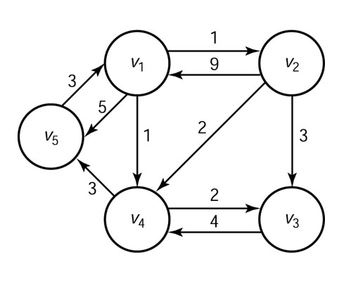

# 最佳路徑演算法


請寫一個程式來實作課本 3.2 節所述的佛洛伊德最短路徑演算法(課本第 106 頁)。你可以使用任何程式語言，如 Java、C、Python 等等。
## 輸入
第一行是圖形的頂點數。第二行及其後是圖形的相鄰矩陣，其中， −1 用來代 表課本中的 ∞。矩陣一列一文字行地輸入，矩陣元素以一個或多個空白字元隔 開。譬如以下是課本圖 3.3 W 矩陣(第 103 頁)的輸入範例:
```
5
0 1 -1 1 5 
9 0 3 2 -1
-1-1 0 4 -1
-1 -1 2 0 3
3 -1 -1 -1 0
```
## 輸出
最短距離矩陣 𝐷(參見課本第 103 頁圖 3.3)，矩陣一列一文字行地輸出，矩陣 元素以一個空白字元隔開，譬如以上的輸入範例會產生以下的輸出結果:
```
0 1 3 1 4
8 0 3 2 5
10 11 0 4 7
6 7 2 0 3
3 4 6 4 0
```
# 進階題
## 輸入
從 V5 到 V2 之中，所經過的節點。
```
5 3
```
## 輸出
V5 V1 V4 V3
